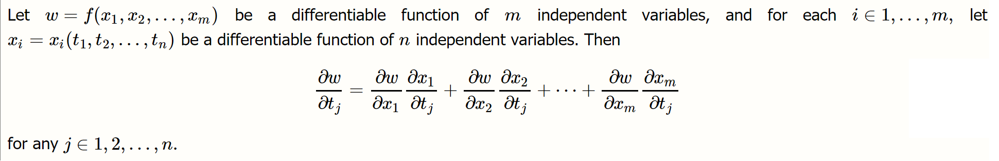
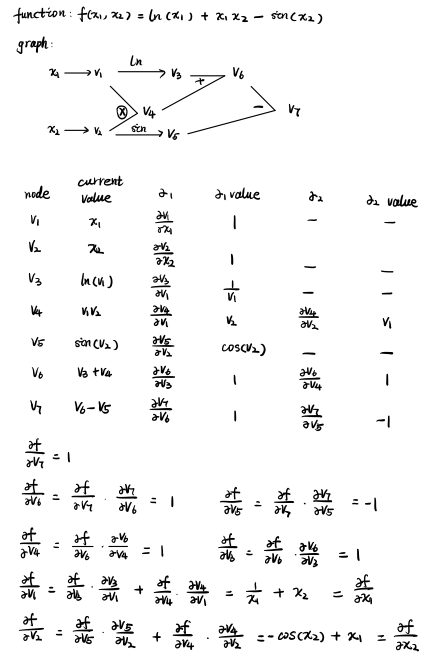

## Introduction

Across a wide range of applications, taking derivatives is essential. For example, we take derivatives on a regular basis in optimization problems where we need to find maxima and minima. In computer programming, there are four main ways to compute derivatives: 

- Manually evaluating them and coding them
- Performing numerical differentiation using finite difference approximations
- Using symbolic differentiation using expression manipulation
- Using automatic differentiation
 
The first three methods have key shortcomings. Manual differentiation is time consuming. Numerical differentiation can be simple to implement but can be highly inaccurate due to rounding errors. Finally, symbolic differentiation may lead to overly complicated expressions.
 
In contrast, automatic differentiation has several advantages. It doesn’t require us to run a single expression; we can break things up into manageable parts using the chain rule. It avoids round-off errors that can be introduced by numerical differentiation, leading to more accurate outputs. It can also handle higher derivatives more easily and do so more efficiently; the rules of differentiation and evaluation can be carried out in parallel, requiring only small amounts of extra storage.
 
In this project, we aim to create an automatic differentiation package so that we can not only run automatic differentiation but also make the software available to others at scale by way of an easy-to-implement python package.

## Background

### Automatic Differentiation & The Forward Mode
Given the notion that AD enables us to compute the derivatives of a function efficiently and accurately, let us dig further into its mathematical mechanism:

**The Chain Rule**

The chain rule is fundamental to AD. It decomposes the derivative calculation for complex functions with multiple layers. A simple example goes as follows:

```
Let F(x) = f(g(x))
```
The derivative of F(x) is, by the chain rule:
```
F'(x)=f'(g(x))g'(x)
```
In the case where we have more than one independent variable, this expression can be easily expanded. We apply the chain rule to composites of more than two functions, facilitating the computation of derivatives.

The generalized chain rule can be shown as:



**Elementary Function**

An elementary function is a simple function of one variable. 

Examples include:
* arithmetic operations (+ – × /)
* exponentials, logarithms, triangle functiosns, etc
* constants

**Forward Mode**

Forward mode, as the name suggests, traverses the chain rule from the inside to the outside of the function. For each step, it calculates a function's current value, as well as the numeric value of this step's elementary function's derivative. In other words, the derivatives are computed in sync with the evaluation steps and are combined with other derivatives via the chain rule. Therefore, the forward mode is easy to understand and implement. (Note that forward mode is less efficient with a large number of parameters.)

For example, we can look at the following funciton, graph, and table to show how we approach the computation with the chain rule in forward mode:


#### Dual Number & AD

The application of dual numbers () is a neat trick in computing AD. We can use dual number operations on numbers to calculate the value of f(x) while calculating f'(x) at the same time. In this way, we get the derivative directly, and the value of the function at the same time, without having to go through the forward mode step by step.

The key to the method is converting x into a dual number, using 1 for the dual component, since we are plugging it in for the value of x, which has a derivative of 1.

In this way, the final solution has the evaluation result (the real component), as well as the derivative in terms of x (the dual component).

#### Multivariate Dual Number & AD

It's also intuitive to use dual numbers with multivariable functions. Since the expected end result is a partial derivative for each variable in the equation, we would just compute a dual number per variable, and process the entire equation for each of those dual numbers separately.

For instance, let's say we want to calculate the partial derivatives of x and y of the function  with the input (5, 2). First, to get the partial derivative of x, we substitue x with  and y with  (when calculating the partial derivative of x, y is a constant). This gives us , saying that the value is 59 at location (5, 2), and the derivative of x at that point is 30 and the partial derivative of y to be -24.


### Automatic Differentiation & The Reverse Mode
**Reverse Mode**

Reverse mode, as the name suggests, computes all the derivatives in reverse order, from the final functions, through yet-to-given variables, to input variables. For each step, it calculates numerical value and the partial derivative of the yet-to-given variable  with respect to variables ,... , that  depends on. Thus, we can calculate a funciton's partial derivative with respect to each input variable in one go. 

For instance, Let one of the yet-to-given variables  be:

```
x1 = t1*t2
```
We can calculate the partial derivatives of  with respect to input variables , . Those partial derivatives are contributing weights of the yet-to-given variable  to calculate the final function's derivative with respect to input variables ,  respectively. We can sum over all yet-to-given variables , ...,  to calculate the derivative of function f with respect to one input variable . As the generalized chain rule shows:


Below is a concrete example of reverse mode:



## How to use CrackAD

#### Installation

**Clone the Repository**

Clone our GitHub repository and navigate into this directory in your terminal:
```
git clone https://github.com/CrackAD/cs207-FinalProject.git
```
In order to use the CrackAD package, you'll need to create a virtual environment. We recommend conda because it is both a package and environment manager and is language agnostic. Please run the following commands in a terminal:

**Create Conda Environment** 

Create an environment with the command, where `env_name` is the name of your choice. Since our package requires the  `NumPy` package, we also install it at this step: 
```
conda create --name env_name python numpy
```

**Activate the Environment**

To activate the Conda environment just created, run the following line:
```
source activate env_name
```
Or 
```
conda activate env_name
```
Yet, it is possible that the second one doesn't work because conda will complain that the shell hasn't been configured to use conda activate. So we would recommend using the first line.

**Install Packages**

If you haven't installed `NumPy` in the first step, or if you ever need to install another package, simply do the following:
```
conda install numpy
```

To check whether the installation succeeded, we could list out all installed packages in this environment:
```
conda list
```

If the `conda install` did not work, try `pip install`:
```
pip install Numpy
```
Note that it is suggested to always try `conda install` first.

#### Demonstration

To use CrackAD, create a .py file (`yourname.py`) with the following lines of code:
```
from EasyDiff.ad import AD
from EasyDiff.var import Var
import numpy as np

# give it a function of your choice
func = lambda x,y: Var.log(x) ** Var.sin(y)

# give the initial values to take the derivatives at
ad = AD(vals=np.array([2, 2]), ders=np.array([1, 1]))

# calculate and print the derivatives
print("Var.log(x) ** Var.sin(y): {}".format(vars(ad.auto_diff(func))))
```
Then, you can run the file in a terminal as follows:
```
python3 yourname.py
```

## Software Organization

Our directory structure will look like:

```
EasyDiff/
	__init__.py
	ad.py
	var.py
	tests/
		__init__.py
		test_ad.py
		test_var.py
docs/
	milestone1.md
	milestone2.md
	generalized_chain_rule.png
	milestone2_graph.png	
README.md
requirements.txt
LICENSE
```
In the directory, we have two python modules `ad.py` and `var.py`. 

* `ad.py`: main algorithms including automatic differentiation and calculating jacobian matrix
* `var.py`: dual number constructions, basic math operations overloaded, and other elementary functions. 

We also include dependencies `numpy` to overload elementory operations.

Our test suite is in the `tests` folder, and we implement `pytest` and `doctest` to write comprehensive tests to provide full coverage for our code. We use `TravisCI` and `CodeCov` to automate the testing process.

EasyDiff has not been distributed on PyPI yet. Instead, users could manully clone our project repository to their personal workspace. Instructions of manual installation is specified in the **Installation** section above.

## Basic: Forward Mode Implementation

#### Core Classes, Important Attributes, and Data Structures

We have two classes as follows: 
- ***Var***: class that contains the value and dual numbers, and provides basic operators manipulating on dual numbers including overloaded build-in operators (eg, *, /, +, -, **) and other elementary functions (eg, sin, sqrt, log, exp). 
- ***AD***: class that builds on top of ***Var*** and provides interface for users to calculate derivatives in different cases (eg, scalar functions of scalar values, vector functions of vector values, and scalar functions of vector values). 

***Var*** has two attributes: the value and the dual numbers (ie, the derivatives against each input variable). The value is a single scale, while the dual numbers are an numpy array of dual numbers with size of *K* where *K* is the number of input variables in the user-defined function. 
For example, we will store parameters *a* and *b_i (1<i<K)* for dual number  if there are *K* input variables. 

***AD*** has a attributes: the Var object array. 


***Var*** class has a bunch of overloaded build-in functions (eg, \*, /, +, -, \*\*) and other elementary functions (ie, sin, cos, tan, arcsin, arccos, arctan, cosh, sinh, tanh, sqrt, log, logk, exp, expk, and logistic functions) implementing dual number operations correspondingly. We implement these elementary functions as ***static methods***. 
Specifically, it haves the following signature: 
```python
class Var():
    def __init__(self, val, dual_paras):
        ...
    def __add__(self, other):
        ...
    def __radd__(self, other):
        ...
    ...
    @staticmethod
    def sin(var):
        ...
    @staticmethod
    def sqrt(var):
        ...
    ...                                
```

***AD*** class includes some functions that users can use to do AD-related calculation. For example, it can include automatic differentiation, Jacobian matrix calculation, etc. Specifically, it has the following signature: 
```python
class AD():
    def __init__(self, vals, ders):
        ...
    def auto_diff(self, func):
        ...
    def jac_matrix(self, funcs):
        ...        
    ...                                
```
where *vals* is an array of the initial values for the *K* input variables, *ders* is an array of the initial derivatives for the *K* input variables, *func* and *funcs* are the input functions (eg, `f1 = lambda x,y: x**2 + y`). 

#### External dependencies and Elementary functions

We will rely on *numpy* library for mathematic operations, and *pytest*, *pytest-cov*, and *doctest* for testing purpose. 

Currently, we cover the following elementary functions: 
* \_\_add\_\_, \_\_radd\_\_, \_\_sub\_\_, \_\_rsub\_\_, \_\_mul\_\_, \_\_rmul\_\_, \_\_truediv\_\_, \_\_rtruediv\_\_, \_\_pow\_\_, \_\_rpow\_\_, 
* \_\_neg\_\_, \_\_pos\_\_, \_\_eq\_\_, \_\_ne\_\_, 
* log(), logk, sqrt(), exp(), expk(),
* sin(), cos(), tan(), arcsin(), arccos(), arctan(), 
* sinh(), cosh(), tanh(), 
* logistic function. 

For python build-in operations (the first two rows), we overload them following the corresponding dual number operations; 
for other elementary functions (the last four rows), we implement them within **Var** class as static methods. 

## Extension: Reverse Mode Implementation

We extend our basic implementation to support reverse-mode automatic differentiation (for detailed mathmatical background about reverse-mode automatic differentiation, please refer to the introduction and motivation sections). 
Specifically, we add a new class named `Rev_Var` that contains the value (`value`), gradient value (`grad_value`), and children (`children`) (using a python list) of reverse-mode node; this class also overload some build-in operators (eg, \*, /, +, -, \*\*) and other elementary functions (eg, sin, sqrt, log, exp) according to the rule of reverse-mode automatic differentiation. These elementary functions are implemented by either overloading or static methods within **Rev_Var** class.

In reverse mode, when implementing these elementary functions, in addition to the corresponding derivative calculation, we also maintain a node dependency graph using the `children` list, which specially contains the weight and `Rev_Var` object of all the children of current node. 

Then, the method `grad()` in the final `Rev_Var` object (produced by user-defined function with multiple input `Rev_Var` objects) calculates its `grad_value` with regards to each input variable, by adding up all the products of `grad_value`s and weights of all its children in a recursive way. 


Specifically, `Rev_Var` has the following signature: 
```python
class Var():
    def __init__(self, value):
        ...
    def grad(self):
        ...
    def __add__(self, other):
        ...
    def __radd__(self, other):
        ...
    ...
    @staticmethod
    def sin(var):
        ...
    @staticmethod
    def sqrt(var):
        ...
    ...                                
```


We also define a `AD_Mode` enum class in `ad.py`, and extend `AD` class to support reverse mode by having an `AD_Mode` enum as input parameters in its `__init__` function. In this way, users can specific which mode is used during creating `AD` objects, and calculate derivatives in the corresponding way. 


Regards the external dependencies, reverse mode implementation depends on the same libraries as the basic forward mode (ie, numpy, pytest, pytest-cov, doctest); it also covers all the elementary functions mentioned in the [Basic: Forward Mode Implementation](#basic-forward-mode-implementation) section. 


